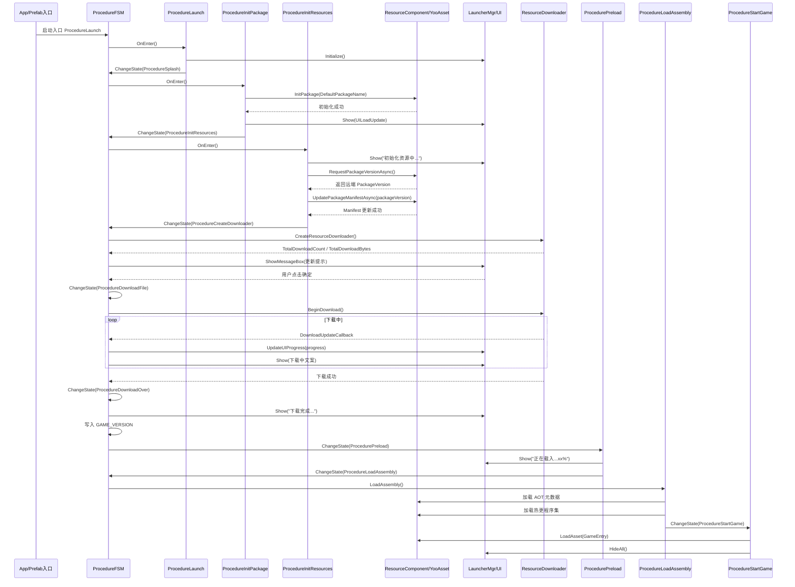
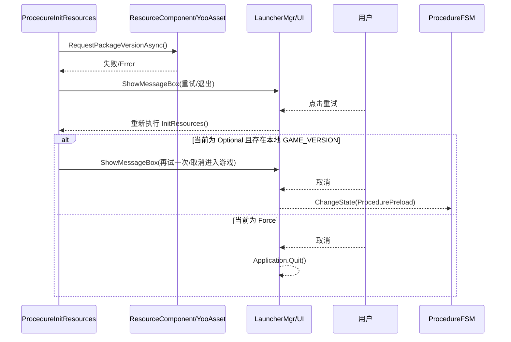

# Launcher 更新流程分析与时序图

## 1. 概述

当前项目的更新流程由启动器 Procedure 状态机驱动，核心目录如下：

- 流程代码：`Assets/Launcher/Scripts/Procedure/`
- 启动器 UI：`Assets/Launcher/Scripts/UI/`
- 更新配置：`Assets/Launcher/Res/Configs/UpdateConfig.asset`
- 资源系统：`Assets/LFramework/Runtime/Component/Resource/ResourceComponent.cs`

当前主链路为：

```text
ProcedureLaunch
-> ProcedureSplash
-> ProcedureInitPackage
-> ProcedureInitResources
-> ProcedureCreateDownloader
-> ProcedureDownloadFile
-> ProcedureDownloadOver
-> ProcedureClearCache（可选）
-> ProcedurePreload
-> ProcedureLoadAssembly
-> ProcedureStartGame
```

入口在：

- `Assets/Launcher/Res/Framework/LFramework.prefab`
- `entranceProcedureTypeName: Launcher.ProcedureLaunch`

---

## 2. 更新流程总览

### 2.1 启动入口

`ProcedureLaunch` 负责：

- 初始化 `LauncherMgr`
- 初始化语言
- 初始化音频
- 下一帧切到 `ProcedureSplash`

`ProcedureSplash` 只做短暂过渡，下一帧进入 `ProcedureInitPackage`。

### 2.2 资源包初始化

`ProcedureInitPackage` 调用：

```csharp
resComponent.InitPackage(resComponent.DefaultPackageName)
```

按资源模式决定后续行为：

- `EditorSimulate`：继续走初始化资源
- `Package`：继续走初始化资源
- `Updatable / WebPlayMode`：先显示更新 UI，再走初始化资源

初始化失败时会：

- 主界面显示“资源初始化失败！”
- 弹出重试 / 退出弹窗
- 如果报 `PackageManifest_DefaultPackage.version` 404，会提示检查 `StreamingAssets` 下版本文件

### 2.3 请求版本与更新清单

`ProcedureInitResources` 是更新链路核心阶段，主要执行两步：

1. 请求远端版本

```csharp
_resComponent.RequestPackageVersionAsync()
```

2. 根据版本更新 Manifest

```csharp
_resComponent.UpdatePackageManifestAsync(packageVersion)
```

成功后根据模式分流：

- `WebPlayMode` 或 `UpdatableWhilePlaying == true`：直接进入 `ProcedurePreload`
- 普通 `Updatable`：进入 `ProcedureCreateDownloader`
- 非更新模式：直接进入 `ProcedurePreload`

### 2.4 创建下载器

`ProcedureCreateDownloader` 调用：

```csharp
resComponent.CreateResourceDownloader()
```

根据 `TotalDownloadCount` 处理：

- 为 `0`：无更新，直接进入 `ProcedureDownloadOver`
- 大于 `0`：统计文件数量与总大小，弹窗让用户确认是否开始下载

### 2.5 下载资源

`ProcedureDownloadFile` 中：

- 绑定下载错误回调
- 绑定进度回调
- 执行 `BeginDownload()`
- 成功后进入 `ProcedureDownloadOver`

下载进度回调会刷新：

- 当前文件数 / 总文件数
- 当前大小 / 总大小
- 百分比
- 当前网速
- 剩余时间

### 2.6 下载完成与收尾

`ProcedureDownloadOver` 会：

- 更新主界面文案为“下载完成...”
- 写入本地版本 `GAME_VERSION`
- 默认进入 `ProcedurePreload`

如果后续需要清理缓存，则会切到 `ProcedureClearCache`，调用：

```csharp
resComponent.ClearCacheFilesAsync()
```

清理完成后再进入 `ProcedurePreload`。

### 2.7 预加载与启动游戏

`ProcedurePreload`：

- 预加载 `PRELOAD` 标签资源
- 更新加载进度文案与进度条
- 完成后进入 `ProcedureLoadAssembly`

`ProcedureLoadAssembly`：

- 加载 AOT 元数据
- 加载 HybridCLR 热更程序集
- 完成后进入 `ProcedureStartGame`

`ProcedureStartGame`：

- 加载 `GameEntry` 预制体
- 实例化到根节点
- 隐藏全部启动器 UI

---

## 3. 当前更新配置

配置文件：`Assets/Launcher/Res/Configs/UpdateConfig.asset`

当前关键配置：

- `UpdateStyle = Force`
- `UpdateNotice = Notice`
- `ResDownLoadPath = http://127.0.0.1:8081`
- `FallbackResDownLoadPath = http://127.0.0.1:8082`
- `projectName = Demo`

运行时 `ResourceComponent` 会把地址组合为：

```text
http://127.0.0.1:8081/Demo/Windows64
http://127.0.0.1:8082/Demo/Windows64
```

因此当前逻辑是“强更 + 有提示 + 主备资源地址”模式。

---

## 4. 版本记录与失败处理

### 4.1 本地版本记录

涉及键值：`GAME_VERSION`

用途：

- 下载成功后记录最新资源版本
- 在可选更新模式下，网络异常时作为本地回退依据

### 4.2 初始化资源失败

`ProcedureInitPackage` 和 `ProcedureInitResources` 都会在失败时弹出重试 / 退出弹框。

### 4.3 强更与可选更新差异

当前项目配置为 `Force`，所以：

- 远端版本获取失败
- Manifest 更新失败

通常都不能直接跳过进入游戏，只能重试或退出。

如果改成 `Optional`，则会：

- 优先读取本地 `GAME_VERSION`
- 存在本地版本时，允许用户重试或直接进入游戏

### 4.4 下载失败

下载失败时会弹框：

```text
Failed to download file : {FileName}
```

行为：

- 确定：回到 `ProcedureCreateDownloader`
- 取消：退出应用

---

## 5. UI 显示分析

UI 总控在：`Assets/Launcher/Scripts/UI/LauncherMgr.cs`

核心界面只有两个：

- `UILoadUpdate`
- `UILoadTip`

### 5.1 UILoadUpdate

文件：`Assets/Launcher/Scripts/UI/UILoadUpdate.cs`

主要控件：

- `_label_desc`：主文案
- `_obj_progress`：进度条
- `_label_appid`：游戏版本号
- `_label_resid`：资源版本号
- `_btn_clear`：清缓存按钮

展示机制：

- 主流程通过 `LauncherMgr.Show(UIDefine.UILoadUpdate, text)` 更新文案
- 进度通过 `LauncherMgr.UpdateUIProgress(progress)` 更新

### 5.2 UILoadTip

文件：`Assets/Launcher/Scripts/UI/UILoadTip.cs`

用途：

- 展示确认 / 取消类弹框
- 支持单按钮、双按钮、三按钮模式

主要用于：

- 初始化失败重试
- 获取版本失败重试
- 下载前确认
- 下载失败提示
- 清缓存确认

### 5.3 文案来源

文件：`Assets/Launcher/Scripts/UI/LoadText.cs`

当前绝大部分更新文案来自 `LoadText` 默认值，但也有部分提示仍是流程中直接硬编码。

### 5.4 样式来源

文件：`Assets/Launcher/Scripts/UI/LoadStyle.cs`

当前样式配置加载逻辑基本未启用，因此：

- 默认按钮文本可用
- 非默认样式依赖的配置未真正初始化

---

## 6. UI 各阶段显示内容

| 阶段     | 主要流程                        | UI 表现                     |
| ------ | --------------------------- | ------------------------- |
| 启动器初始化 | `ProcedureLaunch`           | 初始化 Launcher UI           |
| 资源包初始化 | `ProcedureInitPackage`      | 显示更新主界面                   |
| 资源初始化  | `ProcedureInitResources`    | `初始化资源中...` / `更新清单文件...` |
| 创建下载器  | `ProcedureCreateDownloader` | `创建补丁下载器...`              |
| 下载确认   | `ProcedureCreateDownloader` | 弹框显示更新文件数和总大小             |
| 下载中    | `ProcedureDownloadFile`     | 三行下载文本 + 进度条              |
| 下载完成   | `ProcedureDownloadOver`     | `下载完成...`                 |
| 清缓存    | `ProcedureClearCache`       | `清理未使用的缓存文件...`           |
| 预加载    | `ProcedurePreload`          | `正在载入...xx%` / `载入完成`     |
| 进入游戏   | `ProcedureStartGame`        | 隐藏全部启动器 UI                |

下载中主文案格式为：

```text
正在更新，已更新 当前文件数/总文件数 (百分比)
已更新大小 当前MB/总MB
当前网速 XXX/s，剩余时间 mm:ss
```

---

## 7. 主成功链路时序图



---

## 8. 失败分支时序图



---

## 9. 关键文件清单

- `Assets/Launcher/Res/Framework/LFramework.prefab`
- `Assets/Launcher/Res/Configs/UpdateConfig.asset`
- `Assets/Launcher/Scripts/Procedure/ProcedureLaunch.cs`
- `Assets/Launcher/Scripts/Procedure/ProcedureSplash.cs`
- `Assets/Launcher/Scripts/Procedure/ProcedureInitPackage.cs`
- `Assets/Launcher/Scripts/Procedure/ProcedureInitResources.cs`
- `Assets/Launcher/Scripts/Procedure/ProcedureCreateDownloader.cs`
- `Assets/Launcher/Scripts/Procedure/ProcedureDownloadFile.cs`
- `Assets/Launcher/Scripts/Procedure/ProcedureDownloadOver.cs`
- `Assets/Launcher/Scripts/Procedure/ProcedureClearCache.cs`
- `Assets/Launcher/Scripts/Procedure/ProcedurePreload.cs`
- `Assets/Launcher/Scripts/Procedure/ProcedureLoadAssembly.cs`
- `Assets/Launcher/Scripts/Procedure/ProcedureStartGame.cs`
- `Assets/Launcher/Scripts/UI/LauncherMgr.cs`
- `Assets/Launcher/Scripts/UI/UILoadUpdate.cs`
- `Assets/Launcher/Scripts/UI/UILoadTip.cs`
- `Assets/Launcher/Scripts/UI/LoadText.cs`
- `Assets/Launcher/Scripts/UI/LoadStyle.cs`
- `Assets/Launcher/Scripts/UI/UIDefine.cs`
- `Assets/LFramework/Runtime/Component/Config/UpdateConfig.cs`
- `Assets/LFramework/Runtime/Component/Resource/ResourceComponent.cs`

---

## 10. 当前实现的几个注意点

### 10.1 `GAME_VERSION` 写入时机偏早

`ProcedureInitResources` 在拿到远端版本后，就可能先写一次 `GAME_VERSION`；而 `ProcedureDownloadOver` 下载成功后又会再写一次。  
从语义上说，更合理的最终写入时机应当是“资源真正下载完成之后”。

### 10.2 版本号 UI 预留但当前未见实际调用

`LauncherMgr.RefreshVersion()` 与 `UILoadUpdate.OnRefreshVersion()` 存在，但当前流程中未检索到实际调用点，因此游戏版本号 / 资源版本号控件大概率没有真正动态刷新。

### 10.3 清缓存分支当前看起来未启用

`ProcedureDownloadOver` 中的 `_needClearCache` 目前未检索到赋值来源，因此正常情况下大概率直接进入 `ProcedurePreload`。

### 10.4 部分弹框文案仍为硬编码

例如下载前确认、下载失败提示等，并未完全统一到 `LoadText` 中。

---

## 11. 总结

当前项目更新流程本质上是：

1. 启动 Launcher
2. 初始化 YooAsset 包
3. 请求远端版本与 Manifest
4. 创建下载器并确认更新
5. 下载补丁并实时刷新 UI
6. 写入版本并进入预加载
7. 加载 HybridCLR 程序集
8. 实例化 `GameEntry`，切入正式游戏

UI 侧采用的是“一个主更新面板 + 一个提示弹框”的实现方式：`UILoadUpdate` 负责主文案和进度条，`UILoadTip` 负责确认、重试、退出等交互。
